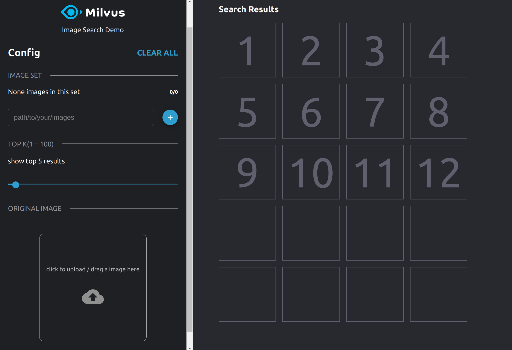
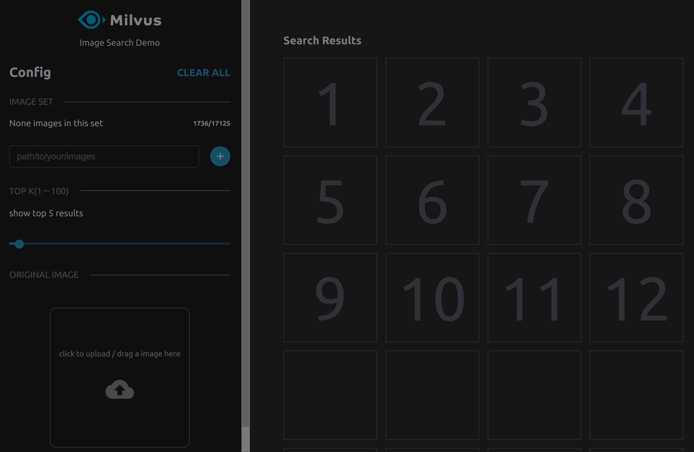
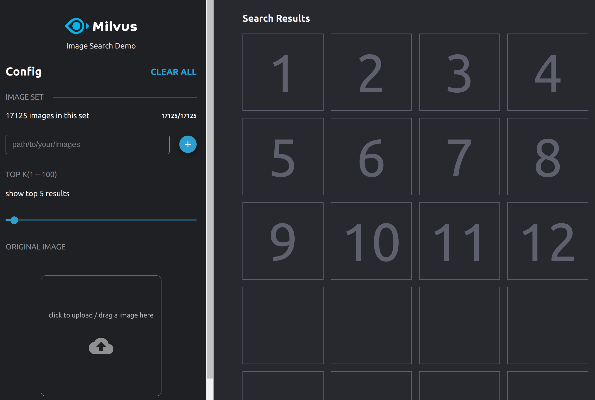
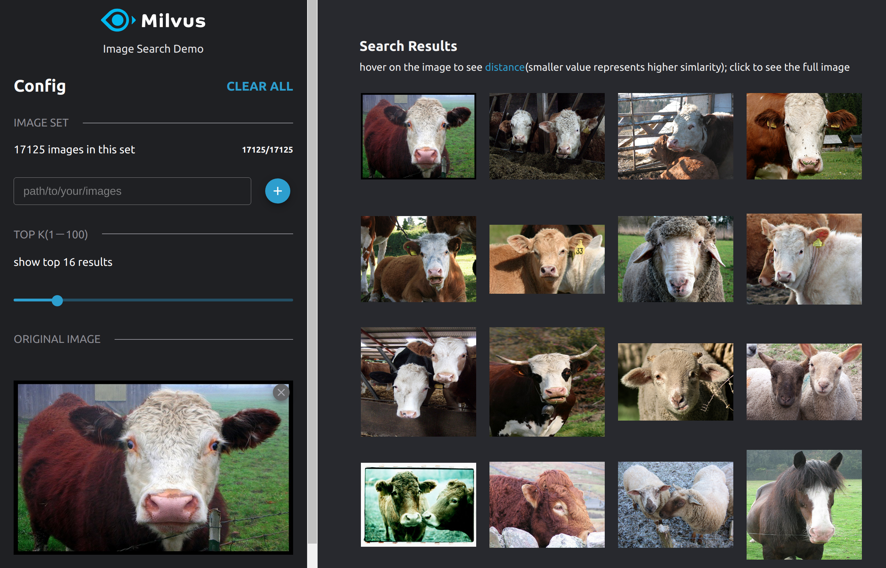

# 基于 Milvus 和 Xception 实现以图搜图

### **部署流程**

> 注意：
>
> 整个部署流程只需要启动 Milvus、pic-search-webserver、pic-search-webclient 三个 docker 容器即可，请务必保证它们的版本是匹配的，否则无法搭建成功。

##### 1、启动 Milvus docker

本实验使用 Milvus0.10.0 版本，启动方法参考链接：https://github.com/milvus-io/docs/blob/v0.10.0/site/zh-CN/guides/get_started/install_milvus/install_milvus.md

##### 2、启动 pic-search-webserver docker

```bash
$ cd webserver
$ docker build -t pic-search-webserver .
```

```bash
$ docker run -d --name zilliz_search_images_demo \
-v ${IMAGE_PATH1}:/tmp/pic1 \
-p 35000:5000 \
-e "DATA_PATH=/tmp/images-data" \
-e "MILVUS_HOST=${MILVUS_IP}" \
pic-search-webserver
```

**IMAGE_PATH1**：

表示你的服务器上存放图片的绝对路径，启动时将这些路径映射到 docker 容器里面。系统搭建好以后，可以直接在前端界面上输入 docker 容器中的图片路径 “ /tmp/pic1 ” 、“ /tmp/pic2 ” 去加载图片。 

**MILVUS_IP** ：

表示启动 Milvus docker 的服务器 IP 地址，注意不要使用回环地址 “127.0.0.1” 。命令其他部分保持不变即可。

##### 3、启动 pic-search-webclient docker

```bash
$ cd webclient
$ docker build -t pic-search-webclient .
```

```bash
$ docker run --name zilliz_search_images_demo_web -d --rm -p 8001:80 \
-e API_URL=http://${WEBSERVER_IP}:35000 \
milvusbootcamp/pic-search-webclient:0.2.0
```

**WEBSERVER_IP**： 表示启动 pic-search-webserver docker 的服务器 IP 地址。


### 界面展示

按照上述部署流程部署完成之后，在浏览器输入 " ${WEBCLIENT_IP}:8001 " 就可以访问以图搜图的界面了，WEBCLIENT_IP 表示启动 pic-search-webclient docker 的服务器 IP 地址。



首先，我们在界面路径框中输入一个 pic_search_webserver docker 容器中存放图片的路径，比如，/tmp/pic1。然后点击右边的加载按钮进行图片加载。加载过程中的界面下图所示：



> 注意：点击加载按钮之后约有1到2秒的响应延迟，请勿重复点击。

等待几分钟后，可以看到图片加载完成后的界面如下图所示：



接着选择一张图片进行搜索：




经实测，在推荐机器配置下，整个以图搜图系统的端到端查询时间可以达到 1 秒以内。如果你想加载 pic_search_webserver docker 容器中其他路径下的图片，可以继续在路径框中输入图片数据的路径。
